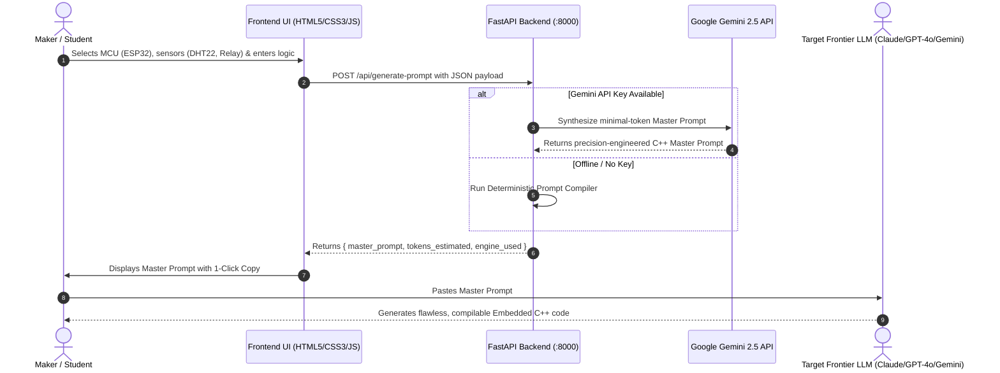

<div align="center">

# 🌐 IoT Saathi — Hardware Prototyping & Embedded C++ Master Prompt Engine

[](https://github.com/bhavya14032007/iot-saathi)
[](https://github.com/bhavya14032007/iot-saathi)
[](https://github.com/bhavya14032007/iot-saathi)
[](https://github.com/bhavya14032007/iot-saathi)

**Public GitHub Repository:** [https://github.com/bhavya14032007/iot-saathi](https://github.com/bhavya14032007/iot-saathi)

</div>

---

## 📌 1. Chosen Vertical

**Vertical:** *Internet of Things (IoT) Hardware Prototyping, Sensor Interfacing & AI-Accelerated Embedded Firmware Engineering.*

### The Problem in IoT Education & Prototyping
Beginners, students, and makers building IoT circuits frequently face two major obstacles:
1. **Circuit & Pin Confusion:** Knowing which pins support I2C, SPI, ADC, or PWM without frying components or encountering GPIO conflicts (e.g., strapping pins on ESP32/ESP8266).
2. **AI Code Hallucinations & Bloat:** When asking generic LLMs to write Arduino/ESP32 C++ code, models often hallucinate non-existent libraries, use blocking `delay()` calls that break WiFi/MQTT concurrency, or produce huge token-heavy outputs that fail to compile or suffer memory leaks (`String` heap fragmentation).

### The IoT Saathi Solution
**IoT Saathi** is an end-to-end prototyping hub combining:
- **Sensor Learning Hub:** Interactive encyclopedia of sensors with pinouts, specs, and reference docs.
- **Project Blueprint Gallery:** Step-by-step schematics and wiring checklists for real-world projects.
- **Embedded C++ Master Prompt Generator:** A dedicated engine powered by a Python backend and **Google Gemini API** that converts user requirements into **ultra-dense, token-minimized Master Prompts**. These prompts force frontier LLMs (Claude 3.5, GPT-4o, Gemini 2.0, DeepSeek) to generate production-ready, non-blocking Embedded C++ code without token waste.

---

## 🧠 2. Approach and Logic

### A. Two-Tier Modular Architecture
The repository is split into two independent, maintainable layers:
```
iot-saathi/
├── backend/                  # Python FastAPI Backend Engine
│   ├── data/                 # Curated starter IoT blueprints
│   │   └── templates.py
│   ├── models/               # Pydantic request & response schemas
│   │   └── prompt_schema.py
│   ├── services/             # Gemini API integration & token minimization
│   │   └── gemini_service.py
│   ├── main.py               # FastAPI application & CORS routing
│   ├── run.py                # Server runner script
│   ├── requirements.txt      # Python dependencies
│   └── .env.example          # Environment variables template
├── frontend/                 # Clean, Semantic Frontend
│   ├── css/                  # 8px Grid System, CSS Variables & Motion rules
│   │   ├── style.css         # Global tokens & layout
│   │   ├── learning.css      # Learning hub styles
│   │   ├── build.css         # DIY projects styles
│   │   └── prompt.css        # Master Prompt Generator styles
│   ├── js/                   # Asynchronous API Client
│   │   └── prompt-generator.js
│   ├── images/               # Logos and diagram assets
│   ├── index.html            # Landing / Overview page
│   ├── learning.html         # Sensor documentation hub
│   ├── build.html            # Step-by-step DIY builds
│   └── prompt_generator.html # Embedded C++ Master Prompt generator
└── README.md                 # Complete system documentation
```

### B. Minimal-Token Prompt Synthesis Logic
Rather than having the backend generate 500 lines of C++ code directly (which consumes massive API tokens and rate limits), the engine uses a meta-prompting technique:
1. **Information Extraction:** Captures MCU target, hardware peripherals, exact GPIO mappings, communication stacks (MQTT/HTTP/BLE), timing, and state transitions.
2. **Dense Constraint Compression:** Injects strict embedded engineering rules (e.g., zero `delay()`, `constexpr uint8_t` pins, `enum class State`, fixed-size buffers instead of dynamic `String`, FreeRTOS task boundaries).
3. **Master Prompt Output:** Produces a compact, single-shot instructional prompt (averaging ~150–250 tokens) formatted for instant copy-paste into any frontier LLM.
4. **Resilient Fallback Engine:** If `GEMINI_API_KEY` is not present or the API is offline, the backend transparently runs a deterministic compiler ensuring 100% system availability.

---

## ⚙️ 3. How the Solution Works



### Step-by-Step Flow:
1. **Input:** The user opens the **Master Prompt Generator**, selects their target microcontroller (e.g. ESP32, Arduino Uno, STM32), selects components (e.g. HC-SR04, OLED, Relay), and enters their functional logic.
2. **Synthesis:** The frontend dispatches an asynchronous request to `POST http://127.0.0.1:8000/api/generate-prompt`.
3. **Optimization:** The FastAPI backend leverages Gemini API with a specialized system instruction that distills user intent into dense, structured requirements.
4. **Execution:** The user copies the Master Prompt with 1 click and pastes it into ChatGPT, Claude, Gemini, or DeepSeek to receive production-ready firmware.

---

## 📋 4. Assumptions Made

1. **Prompt-Only Generation:** The backend focuses strictly on generating the **Master Prompt** rather than generating the final raw C++ firmware directly, fulfilling the core requirement of minimizing token usage while providing maximum flexibility across any AI tool.
2. **Target Microcontrollers:** Assumes standard 3.3V / 5V microcontroller logic (Arduino Uno ATmega328P, ESP8266 NodeMCU, ESP32 WROOM/S3, Raspberry Pi Pico RP2040, and STM32F103).
3. **Non-Blocking Paradigm:** Assumes modern embedded firmware standards where `millis()` or FreeRTOS tasks are preferred over blocking `delay()` to support simultaneous network polling and sensor telemetry.
4. **Zero Vendor Lock-in:** The generated Master Prompt is model-agnostic and functions equally well on Google Gemini, Anthropic Claude, OpenAI GPT-4o, and DeepSeek.

---

## 🚀 5. Getting Started & Running Locally

### Prerequisites
- **Python 3.10+** (Tested on Python 3.13)
- Modern web browser (Chrome, Edge, Firefox)

### Step 1: Clone the Repository
```bash
git clone https://github.com/bhavya14032007/iot-saathi.git
cd iot-saathi
```

### Step 2: Set Up and Run Backend
```bash
# Navigate to backend directory
cd backend

# (Optional) Set your Gemini API Key in .env
# Copy .env.example to .env and add GEMINI_API_KEY=your_key_here

# Install Python dependencies
pip install -r requirements.txt

# Start the FastAPI server
python run.py
```
> The backend API will start on **`http://127.0.0.1:8000`** (Interactive Docs: `http://127.0.0.1:8000/docs`).

### Step 3: Open Frontend
Simply open `frontend/index.html` in your browser, or serve it with any static web server:
```bash
# In a new terminal from repository root
cd frontend
python -m http.server 3000
```
Visit **`http://localhost:3000`** in your browser to access the website!

---

## ♿ Accessibility & Design Standards
- **Semantic HTML5:** Full use of `<header>`, `<nav>`, `<main>`, `<section>`, `<article>`, `<figure>`, and `<footer>` tags for SEO and screen-reader accessibility.
- **8px Grid System:** Consistent spacing tokens (`8px`, `16px`, `24px`, `32px`, `48px`, `64px`) across all layouts.
- **CSS Custom Properties:** All colors structured via CSS variables (`--color-primary: #00bfa6`, `--color-bg`, `--color-card`) supporting dynamic themes.
- **Reduced Motion Support:** `@media (prefers-reduced-motion: reduce)` disables animations and smooth scrolls for users with vestibular sensitivities.

---

## 📄 License & Attribution
- Open-source educational project under MIT License.
- Built with ❤️ for the maker & IoT community by [Bhavya Kapoor](https://github.com/bhavya14032007).
