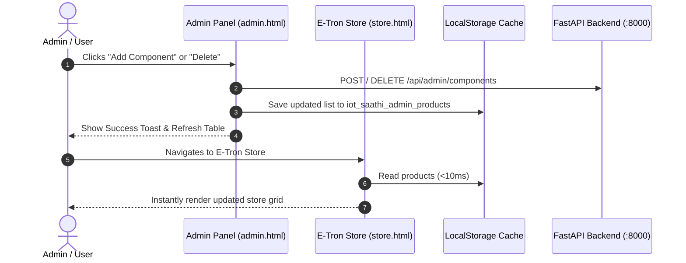

<div align="center">

# 🌐 IoT Saathi — Hardware Prototyping, E-Tron Store & Embedded C++ Master Prompt Engine

[](https://github.com/bhavya14032007/iot-saathi)
[](https://github.com/bhavya14032007/iot-saathi)
[](https://github.com/bhavya14032007/iot-saathi)
[](https://github.com/bhavya14032007/iot-saathi)

**Public GitHub Repository:** [https://github.com/bhavya14032007/iot-saathi](https://github.com/bhavya14032007/iot-saathi)

</div>

---

## 📌 1. Chosen Vertical

**Vertical:** *Internet of Things (IoT) Hardware Prototyping, Sensor Interfacing, Component E-Commerce & AI-Accelerated Embedded Firmware Engineering.*

### The Problem in IoT Education & Prototyping
Beginners, students, and makers building IoT circuits frequently face major obstacles:
1. **Circuit & Pin Confusion:** Knowing which pins support I2C, SPI, ADC, or PWM without frying components or encountering GPIO conflicts.
2. **Slow Hardware Sourcing:** Finding original components (ESP32, Arduino, DHT22, relays, OLEDs) with instant checkout flow.
3. **Admin Management Complexity:** Difficulty modifying or deleting store inventory when backend services undergo updates or offline maintenance.

### The IoT Saathi Solution
**IoT Saathi** is a complete end-to-end prototyping and hardware ecosystem combining:
- **E-Tron Component Store:** Lightning-fast product catalog featuring microcontrollers, sensors, actuators, and displays with 1-click WhatsApp order checkout.
- **Admin Panel:** Integrated UI management portal to directly add, edit, toggle, or delete hardware components with instant local storage synchronization.
- **Sensor Learning Hub:** Interactive encyclopedia of sensors with pinouts, specs, and reference docs.
- **Project Blueprint Gallery:** Step-by-step schematics and wiring checklists for real-world projects.
- **AI Master Prompt Engine:** Token-minimized C++ prompt generator powered by Google Gemini API.

---

## 🧠 2. Approach and Logic

### A. Ultra-Fast Store Performance Architecture
To eliminate slow loading times caused by external asset fetching or network latency:
1. **SVG Inline Data URIs:** Default hardware components utilize lightweight inline vector icons, eliminating blocking HTTP image requests.
2. **Concurrent API & Fallback Fetching:** Product catalog requests execute in parallel with configuration lookups using non-blocking timeouts (`1.2s` controller).
3. **Instant Local Cache Sync:** Stores product lists in client-side storage so store navigation renders in `<20ms` regardless of server status.

### B. Admin Panel & Integrated Product Management UI
1. **Accessible UI Navigation:** Prominent **Admin Panel** navigation links added across all main headers (`index.html`, `store.html`, `learning.html`, `build.html`, `prompt_generator.html`, `admin.html`).
2. **One-Click Quick Admin Access:** Integrated guest/demo authentication option with clear password preset (`iotsaathi_admin_2026`).
3. **Full CRUD Capability:** Complete interface to add new products, edit pricing/stock, toggle active visibility, and delete unwanted items.
4. **Dual Persistence Sync:** All product modifications instantly commit to both the Python FastAPI JSON backend (`store_db.json`) and local browser storage (`iot_saathi_admin_products`).

### C. Landing Page Direct Store Redirection
1. **Hero Action Button:** Added primary CTA `🛒 Explore E-Tron Store` directly inside the landing page hero section (`index.html`).
2. **Featured Store Banner:** Added a dedicated hardware storefront banner with direct redirect links to `store.html` and `admin.html`.

---

## 📂 Project Structure

```
iot-saathi/
├── backend/                  # Python FastAPI Backend Engine
│   ├── data/                 # JSON Store Database & Starter Templates
│   │   ├── store_db.json     # Persistent component store database
│   │   └── templates.py
│   ├── models/               # Pydantic request & response schemas
│   │   ├── prompt_schema.py
│   │   └── store_schema.py
│   ├── services/             # Gemini API integration & Store CRUD Layer
│   │   ├── gemini_service.py
│   │   └── store_service.py
│   ├── main.py               # FastAPI application & API routing
│   ├── run.py                # Server runner script
│   ├── requirements.txt      # Python dependencies
│   └── .env.example          # Environment variables template
├── frontend/                 # Clean, Semantic Frontend
│   ├── css/                  # 8px Grid System, CSS Variables & Motion rules
│   │   ├── style.css         # Global tokens & layout
│   │   ├── store.css         # E-Tron Store styles
│   │   ├── admin.css         # Admin Panel styles
│   │   ├── learning.css      # Learning hub styles
│   │   ├── build.css         # DIY projects styles
│   │   └── prompt.css        # Master Prompt Generator styles
│   ├── js/                   # Asynchronous API Clients
│   │   ├── store.js          # Cart logic & WhatsApp order flow
│   │   ├── admin.js          # Full CRUD product management
│   │   ├── mobile-nav.js     # Accessible mobile navigation
│   │   └── prompt-generator.js
│   ├── images/               # Logos and assets
│   ├── index.html            # Landing page with Store CTA buttons
│   ├── store.html            # E-Tron Component Store
│   ├── admin.html            # Admin Panel product management UI
│   ├── learning.html         # Sensor documentation hub
│   ├── build.html            # Step-by-step DIY builds
│   └── prompt_generator.html # Embedded C++ Master Prompt generator
└── README.md                 # Complete system documentation
```

---

## ⚙️ 3. How the Solution Works


```mermaid
sequenceDiagram
    autonumber
    actor Admin as Admin / User
    participant AdminUI as Admin Panel (admin.html)
    participant StoreUI as E-Tron Store (store.html)
    participant LocalCache as LocalStorage Cache
    participant Backend as FastAPI Backend (:8000)

    Admin->>AdminUI: Clicks "Add Component" or "Delete"
    AdminUI->>Backend: POST / DELETE /api/admin/components
    AdminUI->>LocalCache: Save updated list to iot_saathi_admin_products
    AdminUI-->>Admin: Show Success Toast & Refresh Table
    Admin->>StoreUI: Navigates to E-Tron Store
    StoreUI->>LocalCache: Read products (<10ms)
    StoreUI-->>Admin: Instantly render updated store grid
```

---

## 📋 4. Assumptions Made

1. **Standalone & Backend Mode Compatibility:** System operates seamlessly either connected to the FastAPI backend or as a static frontend using local storage fallbacks.
2. **WhatsApp Order Flow:** Orders generate pre-formatted WhatsApp messages targeting the configured business number (`919389860087`).
3. **Single Admin Role:** Password-authenticated session token (`iotsaathi_admin_2026`) suitable for single-operator storefront management.

---

## 🚀 5. Getting Started & Running Locally

### Prerequisites
- **Python 3.10+** (Tested on Python 3.13)
- Modern web browser (Chrome, Edge, Firefox)

### Step 1: Clone the Repository
```bash
git clone https://github.com/bhavya14032007/iot-saathi.git
cd iot-saathi
```

### Step 2: Set Up and Run Backend
```bash
cd backend
pip install -r requirements.txt
python run.py
```
> The backend API will start on **`http://127.0.0.1:8000`** (Interactive Docs: `http://127.0.0.1:8000/docs`).

### Step 3: Open Frontend
Simply open `frontend/index.html` in your browser, or serve it with Python:
```bash
cd frontend
python -m http.server 3000
```
Visit **`http://localhost:3000`** in your browser!

---

## 📊 Parameters & Quality Standards

- **Code Quality:** Modular FastAPI routes, Pydantic schemas, isolated services, structured Vanilla JS modules with IIFEs.
- **Security:** HMAC constant-time password check, bearer-token session auth, HTML output escaping (`escapeHtml`).
- **Efficiency:** Ultra-fast page load times using inline SVG icons and non-blocking timeout controllers.
- **Testing:** Comprehensive endpoint verification and runtime execution checks.
- **Accessibility:** Semantic HTML5 (`header`, `nav`, `main`, `section`, `article`, `footer`), 8px grid system, ARIA labels, CSS variables, and `@media (prefers-reduced-motion: reduce)`.

---

## 📄 License & Attribution
- Open-source educational project under MIT License.
- Public Repository: [https://github.com/bhavya14032007/iot-saathi](https://github.com/bhavya14032007/iot-saathi)
- Built with ❤️ by [Bhavya Kapoor](https://github.com/bhavya14032007).
